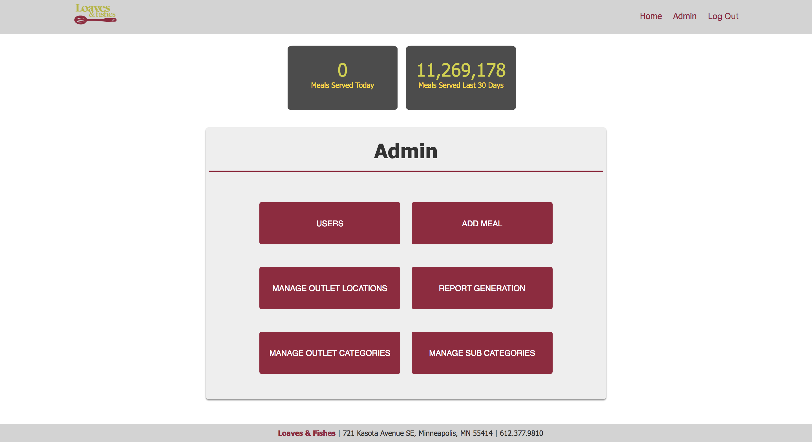
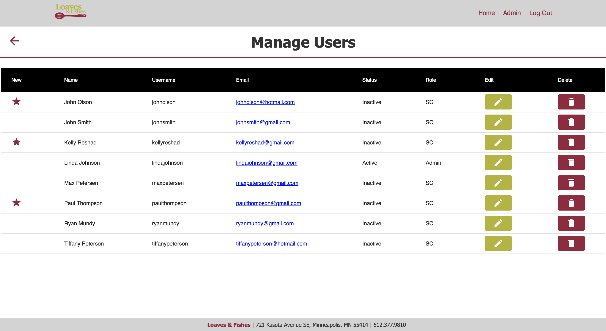
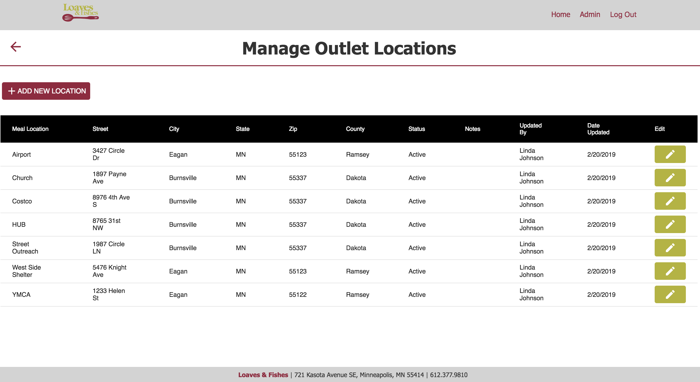
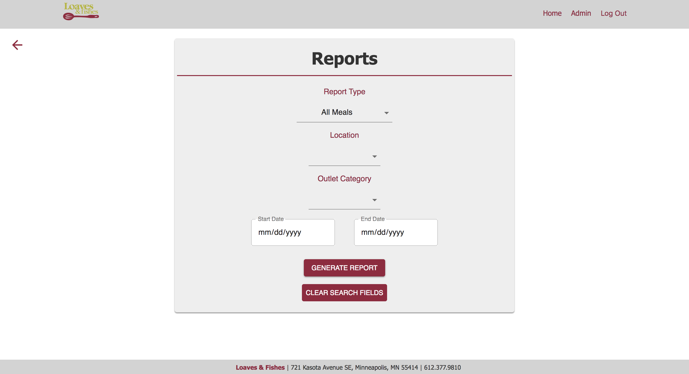
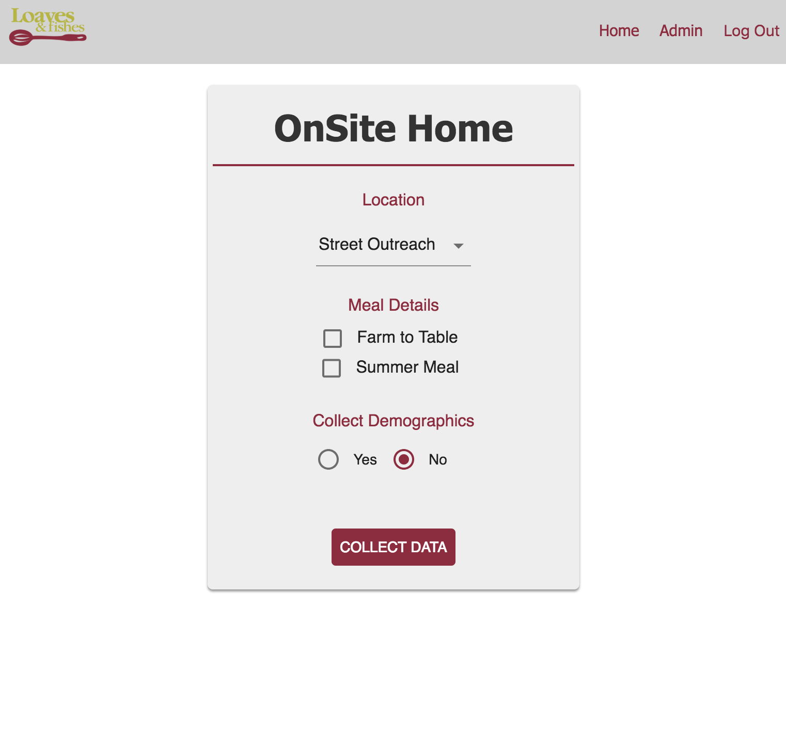
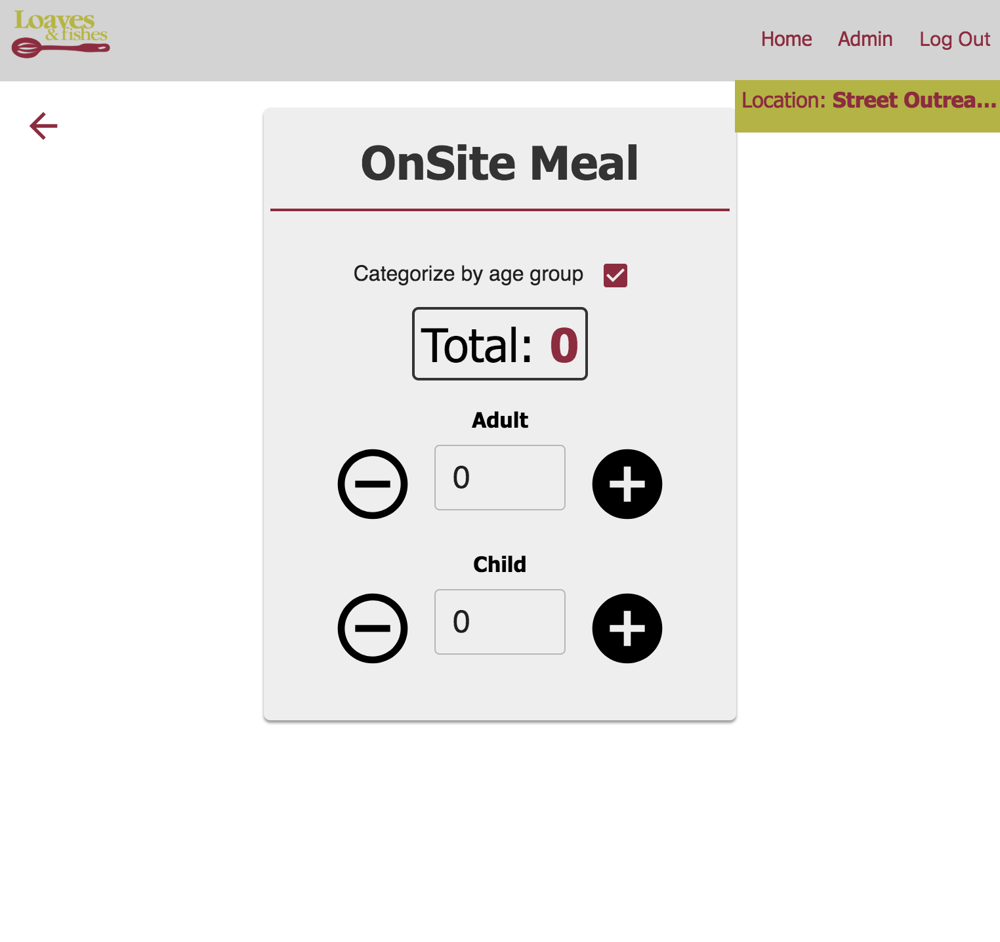

# Loaves & Fishes 1.0
Loaves & Fishes is currently using a system that can be time consuming by utilizing a paper system for tracking each and every dining site, for which they have over 80 locations. Afterwards, these massive pile of sheets are being manually entered into an Excel Spreadsheet. Keep in mind, Loaves & Fishes have served a record number of 1,000,000 meals in 2018, and are expected to serve 1,300,000 this year. With the record breaking numbers, we replace this laborious process with a digital system that is more efficient to the organization. This system will allow users to gather information about meals on site in real time and also manage locations and generate reports to assist with grant applications.

## Built With
* React
* Redux-Saga
* Node
* Express
* Postico
* PostgreSQL
* HTML
* Javascript
* CSS 
* Sweetalert
* React-CSV
* React-Detect-Offline
* Moment

## Prerequisites

Before you get started, make sure you have the following software installed on your computer:

- [Node.js](https://nodejs.org/en/)
- [PostrgeSQL](https://www.postgresql.org/)
- [Nodemon](https://nodemon.io/)

## Create database and table

Create a new database called `loaves_and_fishes` and create the tables below:\

database.sql file will have all the tables, you can copy & paste this into SQL Query using Postico.

```SQL
CREATE TABLE "person"
(
"id" serial NOT NULL,
"name" varchar(300) NOT NULL,
"username" varchar(300) NOT NULL UNIQUE,
"password" varchar(300) NOT NULL,
"email" varchar(1000) NOT NULL,
"last_location" integer,
"status" BOOLEAN NOT NULL DEFAULT 'false',
"new" BOOLEAN NOT NULL DEFAULT 'true',
"admin" BOOLEAN NOT NULL DEFAULT 'false',
CONSTRAINT person_pk PRIMARY KEY ("id")
)
WITH (
OIDS=FALSE
);

CREATE TABLE "location"
(
"id" serial NOT NULL,
"location_name" varchar(300) NOT NULL,
"street_address" varchar(500) NOT NULL,
"city" varchar(500) NOT NULL,
"state" varchar(500) NOT NULL,
"zip" integer NOT NULL,
"county" varchar(500) NOT NULL,
"active" BOOLEAN NOT NULL DEFAULT 'true',
"notes" varchar(1000),
"updated_by" integer,
"date_updated" TIMESTAMP,
CONSTRAINT location_pk PRIMARY KEY ("id")
)
WITH (
OIDS=FALSE
);

CREATE TABLE "meal_outlet_category"
(
"id" serial NOT NULL,
"category_name" varchar(500) NOT NULL,
"sub_category" integer,
"notes" varchar(1000),
"active" BOOLEAN NOT NULL DEFAULT 'true',
"updated_by" integer,
"date_updated" TIMESTAMP,
CONSTRAINT meal_outlet_category_pk PRIMARY KEY ("id")
)
WITH (
OIDS=FALSE
);

CREATE TABLE "count"
(
"id" serial NOT NULL,
"meal_count" integer NOT NULL DEFAULT '1',
"timestamp" DATE NOT NULL,
"summer" BOOLEAN NOT NULL DEFAULT 'false',
"farm" BOOLEAN NOT NULL DEFAULT 'false',
"location_id" integer NOT NULL,
"gender_id" integer,
"race_id" integer,
"age_id" integer,
CONSTRAINT count_pk PRIMARY KEY ("id")
)
WITH (
OIDS=FALSE
);

CREATE TABLE "location_outlet"
(
"id" serial NOT NULL,
"location_id" integer NOT NULL,
"outlet_id" integer NOT NULL,
CONSTRAINT location_outlet_pk PRIMARY KEY ("id")
)
WITH (
OIDS=FALSE
);

CREATE TABLE "outlet_sub_category"
(
"id" serial NOT NULL,
"category_name" varchar(300) NOT NULL,
CONSTRAINT outlet_sub_category_pk PRIMARY KEY ("id")
)
WITH (
OIDS=FALSE
);

CREATE TABLE "gender"
(
"id" serial NOT NULL,
"gender_name" varchar(500),
CONSTRAINT gender_pk PRIMARY KEY ("id")
)
WITH (
OIDS=FALSE
);

CREATE TABLE "race"
(
"id" serial NOT NULL,
"race_name" varchar(500),
CONSTRAINT race_pk PRIMARY KEY ("id")
)
WITH (
OIDS=FALSE
);

CREATE TABLE "age"
(
"id" serial NOT NULL,
"age_category" varchar(500) NOT NULL,
CONSTRAINT age_pk PRIMARY KEY ("id")
)
WITH (
OIDS=FALSE
);

ALTER TABLE "person" ADD CONSTRAINT "person_fk0" FOREIGN KEY ("last_location") REFERENCES "location"("id");

ALTER TABLE "location" ADD CONSTRAINT "location_fk0" FOREIGN KEY ("updated_by") REFERENCES "person"("id");

ALTER TABLE "meal_outlet_category" ADD CONSTRAINT "meal_outlet_category_fk0" FOREIGN KEY ("sub_category") REFERENCES "outlet_sub_category"("id");
ALTER TABLE "meal_outlet_category" ADD CONSTRAINT "meal_outlet_category_fk1" FOREIGN KEY ("updated_by") REFERENCES "person"("id");

ALTER TABLE "count" ADD CONSTRAINT "count_fk0" FOREIGN KEY ("location_id") REFERENCES "location"("id");
ALTER TABLE "count" ADD CONSTRAINT "count_fk1" FOREIGN KEY ("gender_id") REFERENCES "gender"("id");
ALTER TABLE "count" ADD CONSTRAINT "count_fk2" FOREIGN KEY ("race_id") REFERENCES "race"("id");
ALTER TABLE "count" ADD CONSTRAINT "count_fk3" FOREIGN KEY ("age_id") REFERENCES "age"("id");

ALTER TABLE "location_outlet" ADD CONSTRAINT "location_outlet_fk0" FOREIGN KEY ("location_id") REFERENCES "location"("id");
ALTER TABLE "location_outlet" ADD CONSTRAINT "location_outlet_fk1" FOREIGN KEY ("outlet_id") REFERENCES "meal_outlet_category"("id");

INSERT INTO "gender"
("gender_name")
VALUES('Female'),
('Male'),
('Transgender'),
('Gender Unknown');

INSERT INTO "race"
("race_name")
VALUES('African'),
('African / American'),
('Native American / American Indian'),
('Asian / Pacific Islander'),
('Caucasian / White'),
('Hispanic / Latino'),
('Multi-racial'),
('Race Unknown');

INSERT INTO "age"
("age_category")
VALUES('Preschool (0-4)'),
('Child (5-12)'),
('Teen (13-19)'),
('Young Adult (20-25)'),
('Adult (26-54)'),
('Senior (55+)'),
('Age Unknown'),
('Generic Child'),
('Generic Adult');

INSERT INTO "outlet_sub_category"
("category_name")
VALUES('None'),
('Open'),
('Closed');

INSERT INTO "meal_outlet_category"
("category_name")
VALUES('CACFP'),
('CMP'),
('HUB'),
('Produce Market'),
('Public Dining'),
('SFSP'),
('Street Outreach');
```

If you would like to name your database something else, you will need to change `loaves_and_fishes` to the name of your new database name in `server/modules/pool.js`

## Development Setup Instructions

* Run `npm install`
* Create a `.env` file at the root of the project and paste this line into the file:
    ```
    SERVER_SESSION_SECRET=superDuperSecret
    ```
    While you're in your new `.env` file, take the time to replace `superDuperSecret` with some long random string like `25POUbVtx6RKVNWszd9ERB9Bb6` to keep your application secure. Here's a site that can help you: [https://passwordsgenerator.net/](https://passwordsgenerator.net/). If you don't do this step, create a secret with less than eight characters, or leave it as `superDuperSecret`, you will get a warning.

* Start postgres if not running already by using `brew services start postgresql`
* Run `npm run server`
* Run `npm run client`
* Navigate to `localhost:3000`

## Screenshots

Admin Home:\


Admin Manage Users:\


Admin Manage Locations:\


Admin Reports:\


OnSite Home:\


OnSite Count:\



## Documentation

https://docs.google.com/document/d/1K3tjSSJdNI1abhJECg6zWGE7mveJjZLQF9Au_aKUs3k/edit#heading=h.x5497hm2698b

### Completed Features

* Count in Admin dashboard of meal count in real time
* Report Generation that exports into a CSV file
* Admin has the ability to manage users, locations, categories, and sub categories (CRUD)
* Admin has ability to add meals if meal counts are inaccurate
* On site meal count allows user to quickly submit meal counts
* Location of last selected location for user when logged in 

### Next Steps

* Report for comparison of years
* Graph to display after generating a report

## Deployment

* Run npm install
* Create a .env file at the root of the project and paste this line into the file:
SERVER_SESSION_SECRET=superDuperSecret
While you're in your new .env file, take the time to replace superDuperSecret with some long random string like 25POUbVtx6RKVNWszd9ERB9Bb6 to keep your application secure. Here's a site that can help you: https://passwordsgenerator.net/. If you don't do this step, create a secret with less than eight characters, or leave it as superDuperSecret, you will get a warning.
* Start postgres if not running already by using brew services start postgresql
* Run npm run server
* Run npm run client
* Navigate to localhost:3000

## Authors

* Abdul Ismail, JD Ghuman, Ryan Mundy, & Victoria Chhieng
